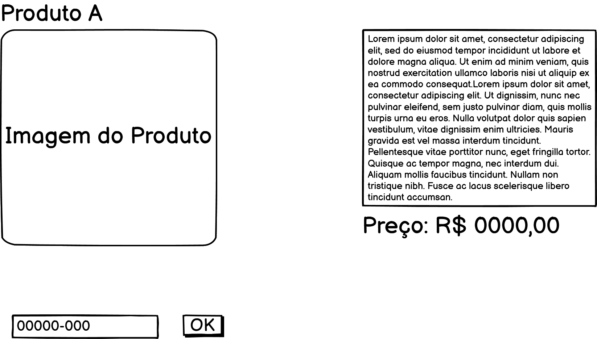
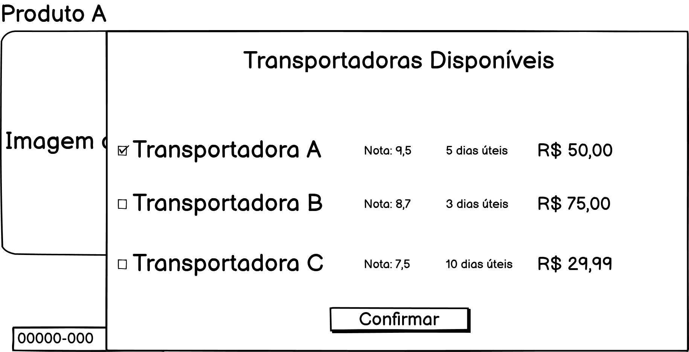
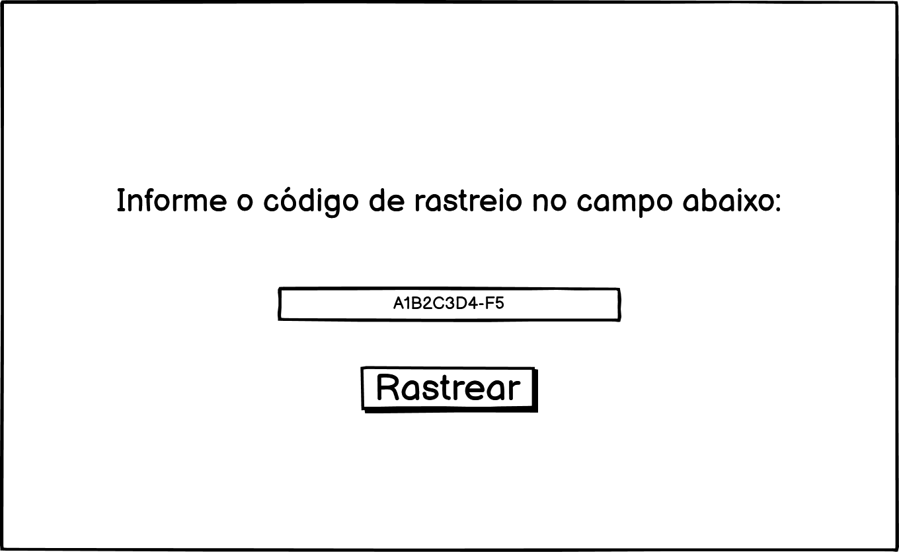
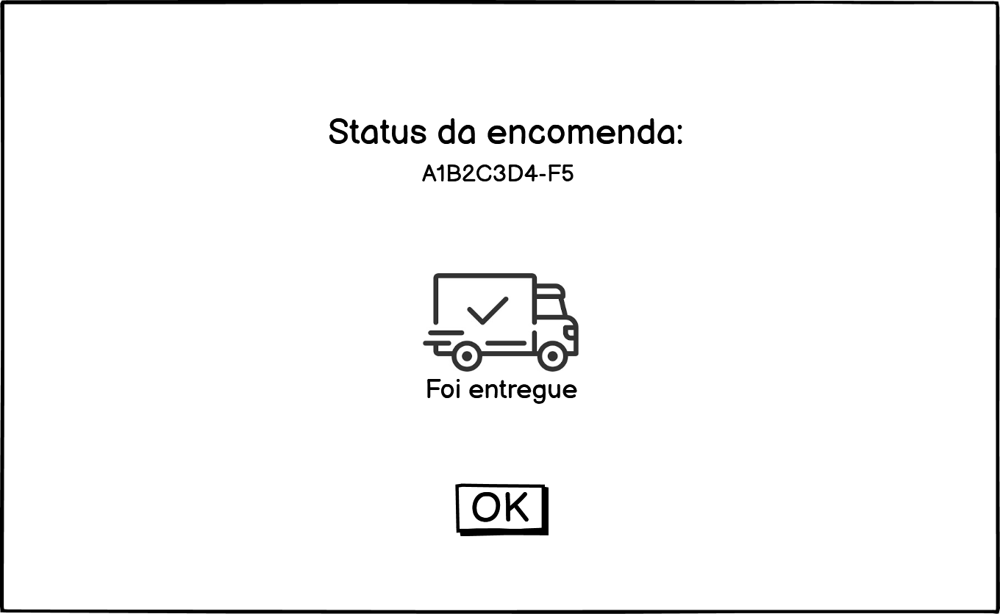

# Projeto de Interface

Pré-requisitos: <a href="2-Especificação do Projeto.md"> Documentação de Especificação</a>

Visão geral da interação do usuário pelas telas do sistema e protótipo interativo das telas com as funcionalidades que fazem parte do sistema (wireframes).

 Apresente as principais interfaces da plataforma. Discuta como ela foi elaborada de forma a atender os requisitos funcionais, não funcionais e histórias de usuário abordados nas <a href="2-Especificação do Projeto.md"> Documentação de Especificação</a>.

## Diagrama de Fluxo

O diagrama apresenta o estudo do fluxo de interação do usuário com o sistema interativo e  muitas vezes sem a necessidade do desenho do design das telas da interface. Isso permite que o design das interações seja bem planejado e gere impacto na qualidade no design do wireframe interativo que será desenvolvido logo em seguida.

O diagrama de fluxo pode ser desenvolvido com “boxes” que possuem internamente a indicação dos principais elementos de interface - tais como menus e acessos - e funcionalidades, tais como editar, pesquisar, filtrar, configurar - e a conexão entre esses boxes a partir do processo de interação. Você pode ver mais explicações e exemplos https://www.lucidchart.com/blog/how-to-make-a-user-flow-diagram.

As referências abaixo irão auxiliá-lo na geração do artefato “Diagramas de Fluxo”.

> **Links Úteis**:
> - [Fluxograma online: seis sites para fazer gráfico sem instalar nada | Produtividade | TechTudo](https://www.techtudo.com.br/listas/2019/03/fluxograma-online-seis-sites-para-fazer-grafico-sem-instalar-nada.ghtml)

## Wireframes

### Página da Loja do Cliente

Nesta página, o cliente da Loja deverá colocar o CEP para entrega. Caso o seu CEP seja da região de Belo Horizonte-MG, ele receberá as melhores transportadoras para a entrega.

### Transportadoras Disponíveis

Após digitar um CEP da região de Belo Horizonte-MG, aparecerá as melhores transportadoras para a entrega.

### Saber Status da Encomenda

O usuário do deverá colocar o Código de Rastreio do pedido para saber se a encomenda foi enviada ou já está entregue. Podendo ter localização em tempo real através da empresa que está responsável pela entrega, caso a empresa forneça este serviço.

### Status da Encomenda Enviada

Esta tela é mostrada ao usuário caso sua encomenda tenha sido enviada.

### Status da Encomenda Entregue

Esta tela é mostrada ao usuário caso sua encomenda tenha sido entregue.

