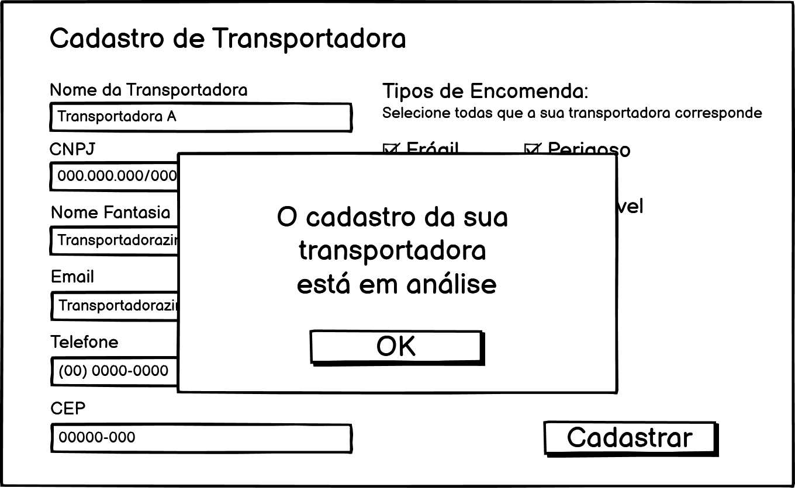
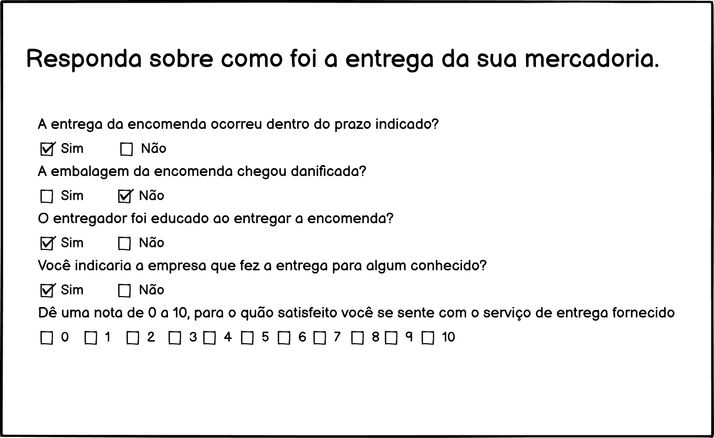

# Projeto de Interface

Pré-requisitos: <a href="2-Especificação do Projeto.md"> Documentação de Especificação</a>

Visão geral da interação do usuário pelas telas do sistema e protótipo interativo das telas com as funcionalidades que fazem parte do sistema (wireframes).

 Apresente as principais interfaces da plataforma. Discuta como ela foi elaborada de forma a atender os requisitos funcionais, não funcionais e histórias de usuário abordados nas <a href="2-Especificação do Projeto.md"> Documentação de Especificação</a>.

## Diagrama de Fluxo

## Wireframes

### Página da Loja do Cliente

Nesta página, o cliente da Loja deverá colocar o CEP para entrega. Caso o seu CEP seja da região de Belo Horizonte-MG, ele receberá as melhores transportadoras para a entrega.

### Transportadoras Disponíveis

Após digitar um CEP da região de Belo Horizonte-MG, aparecerá as melhores transportadoras para a entrega.

### Saber Status da Encomenda

O usuário do deverá colocar o Código de Rastreio do pedido para saber se a encomenda foi enviada ou já está entregue. Podendo ter localização em tempo real através da empresa que está responsável pela entrega, caso a empresa forneça este serviço.

### Status da Encomenda Enviada

Esta tela é mostrada ao usuário caso sua encomenda tenha sido enviada.

### Status da Encomenda Entregue

Esta tela é mostrada ao usuário caso sua encomenda tenha sido entregue.

### Página Inicial de Cadastro de Transportadora

Página de Cadastro de transportadoras parceiras. O usuário será redirecionado para esta página quando for fazer um cadastro, ou tiver feito um cadastro bem sucedido.

### Cadastro de Transportadora ao Banco de Dados da Strade

Empresas que querem ser parceiras da Strade e serem clientes, poderão cadastrar sua transportadoras nesta página, preenchendo os dados e clicando em 'Cadastrar'.

### Transportadora em Análise

Após cadastrar a transportadora, ela será analisada e o usuário receberá essa mensagem.

### Avaliação de Entrega da Encomenda

O usuário virá para essa tela após receber um link no seu e-mail constando a identificação do seu pedido e poderá avaliar a empresa que foi responsável pela entrega da encomenda.

