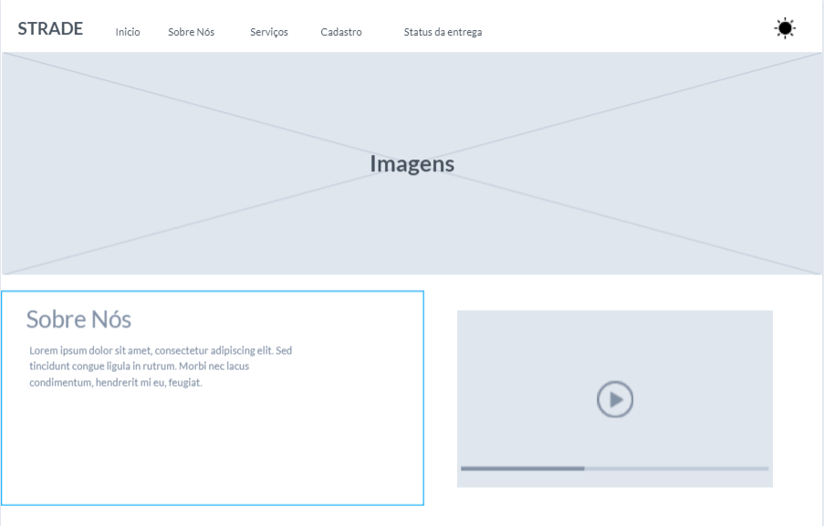
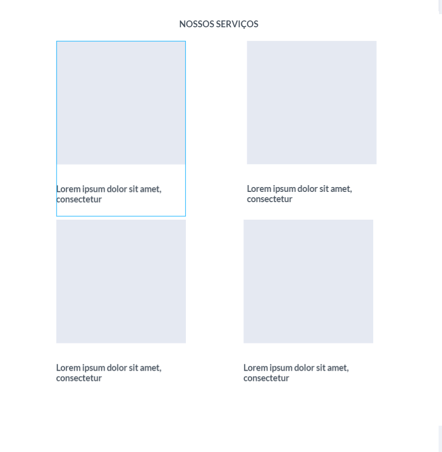
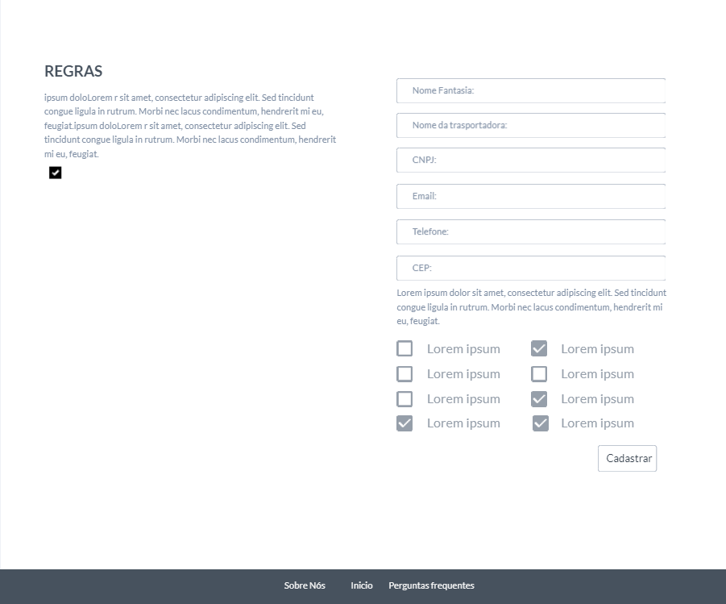
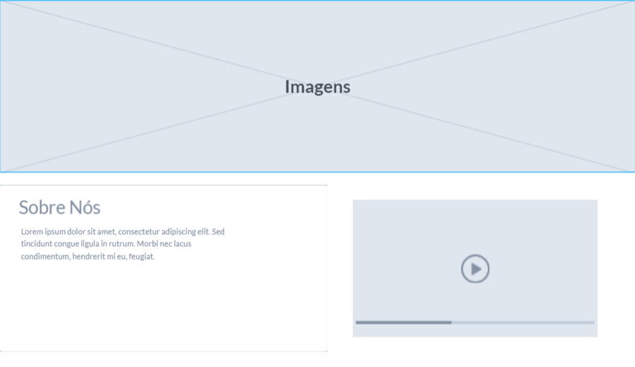
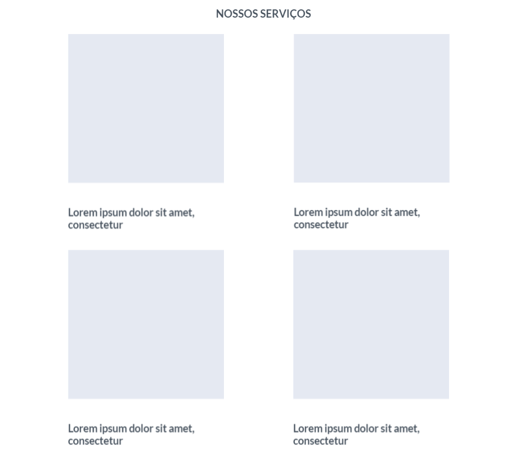
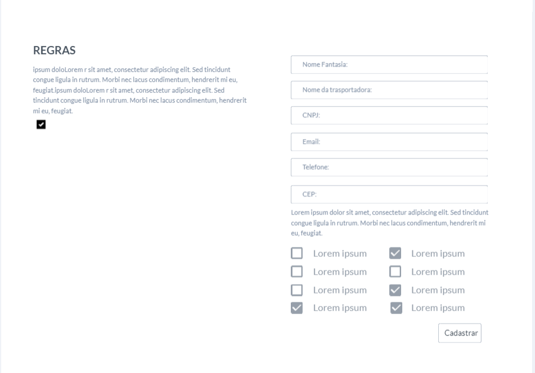
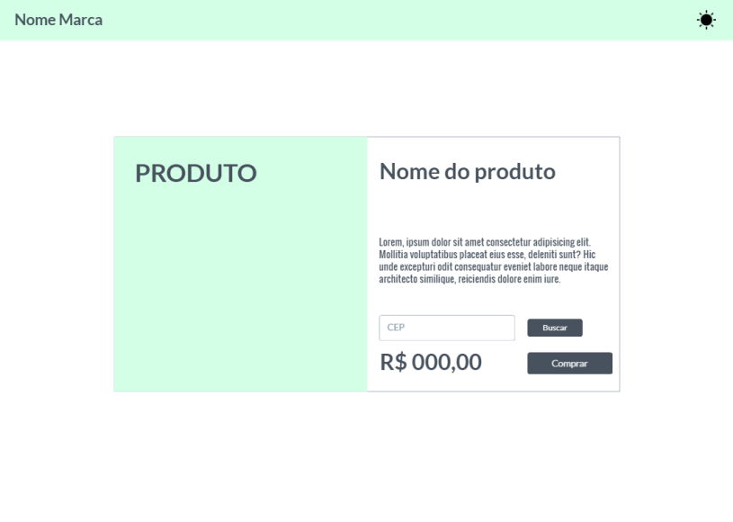
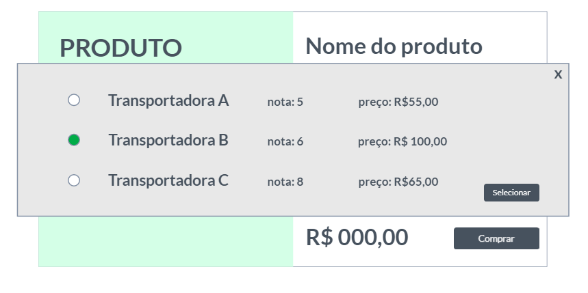

# Template Padrão da Aplicação

Pré-requisitos: <a href="2-Especificação do Projeto.md"> Especificação do Projeto</a>, <a href="3-Projeto de Interface.md"> Projeto de Interface</a>, <a href="4-Metodologia.md"> Metodologia</a>

Definição de como serão as páginas e suas funcionalidades.

O template é composto pelos seguintes layouts:

- Inicio
- Sobre Nós 
- Serviços
- Cadastro

## Tela Principal

Layout no estilo página única, que abrange o inicio, o sobre nós, serviços e cadastro. 

>
>
>

## Menu de Navegação

Menu onde o usuário tem a opção de navegar pela página. Além de conseguir fazer a troca para o modo de Hipersensibilidade.

>

## Conteúdo Principal
### Inicio
Imagens de apresentação e Navbar.

### Sobre nós

Faz uma breve apresentação da Strade para o usuário.

>

### Serviços

Faz uma breve apresentação dos serviços prestados pela empresa para o usuário.
>

### Cadastrar

Formulário para cadastro do cliente. Campos para preenchimeto com dados das trasportadoras e explicação das regras para fazer parte da STRADE.

>

### Footer

Navegação pela página.

>

## Tela Principal Loja

Layout no estilo do site da Loja, em que nosso sistema irá atuar na seleção das trasportadoras pelo cliente.

### Tela do Produto da Loja

>

### CEP

Cliente precisa buscar o CEP de entrega para ter acesso a lista de trasportadoras que entregam na região dele.

>

### Lista de Transpotadoras

Lista das trasportadoras disponiveis para seleção do cliente.
>

