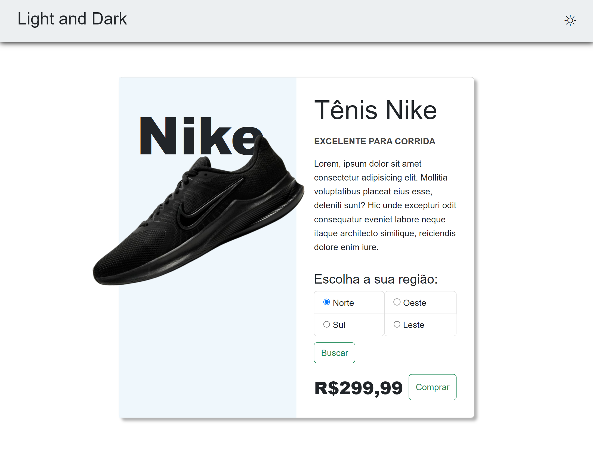
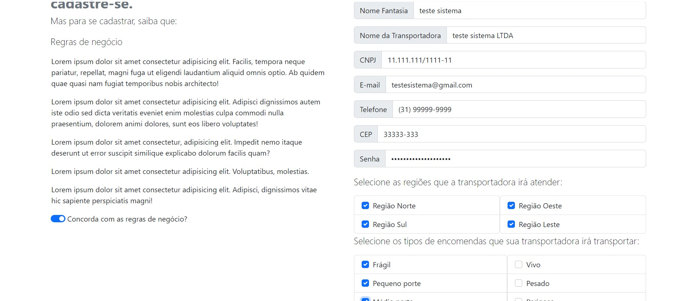
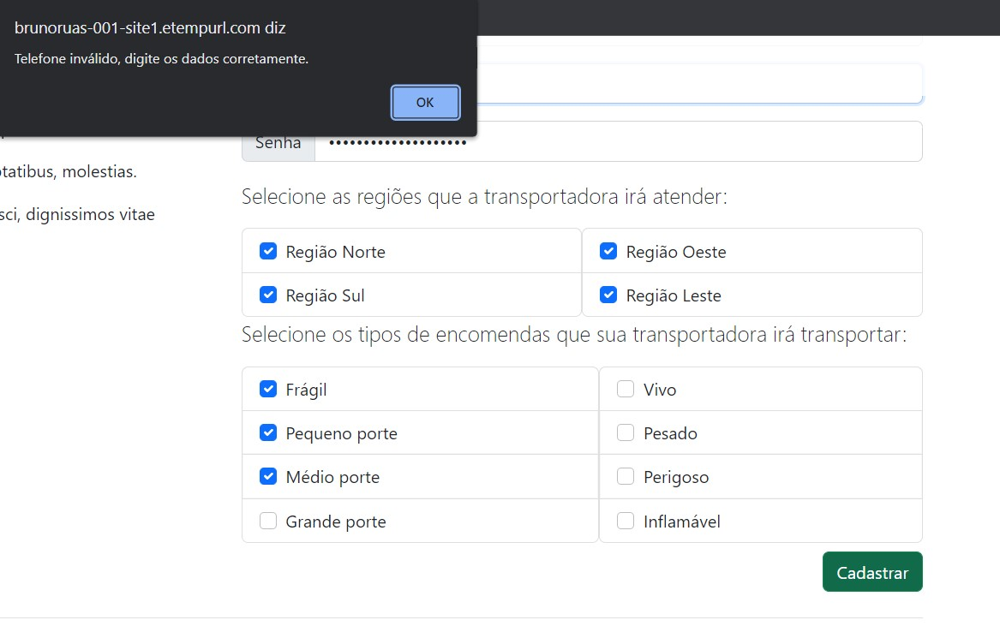
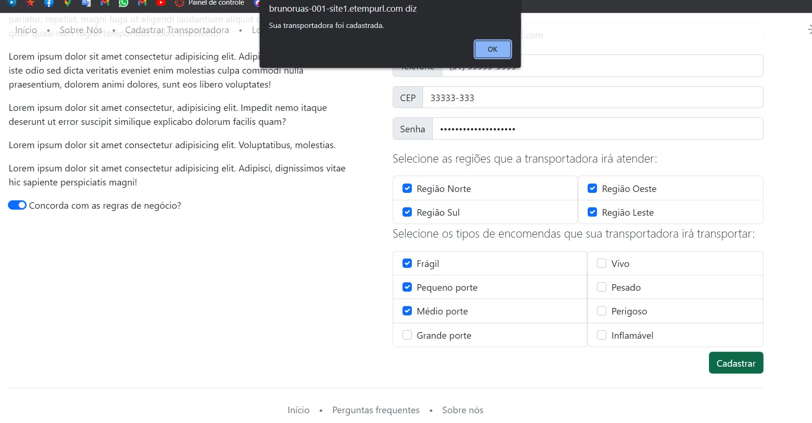
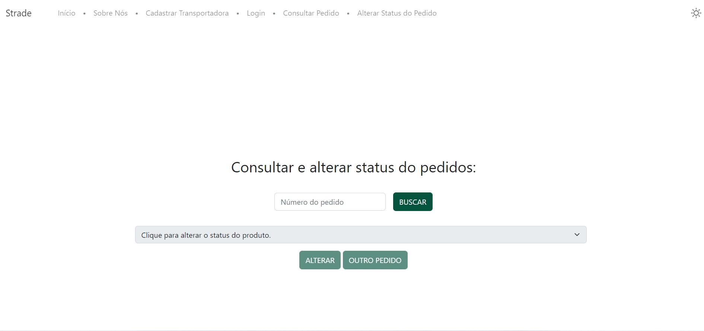
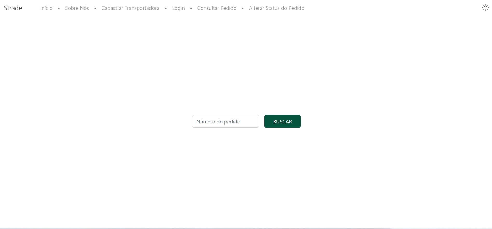
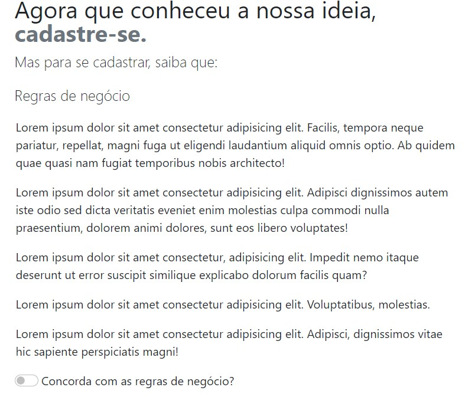
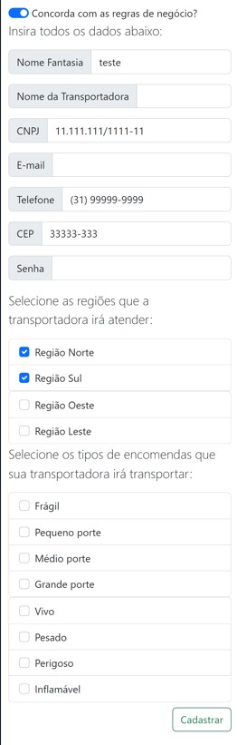

# Registro de Testes de Software Primeira Etapa

Pré-requisitos: <a href="3-Projeto de Interface.md"> Projeto de Interface</a>, <a href="8-Plano de Testes de Software.md"> Plano de Testes de Software</a>

Para cada caso de teste definido no Plano de Testes de Software, realize o registro das evidências dos testes feitos na aplicação pela equipe, que comprovem que o critério de êxito foi alcançado (ou não!!!). Para isso, utilize uma ferramenta de captura de tela que mostre cada um dos casos de teste definidos (obs.: cada caso de teste deverá possuir um vídeo do tipo _screencast_ para caracterizar uma evidência do referido caso).

## CT-01 - Lista de Trasportadoras - Site Loja

### Preenchimento da Região - Site Loja

>

A referida funcionalidade foi substituída por uma simplificação de busca por regiões ao invés de ceps.

## CT-02 – Cadastrar transportadora

### Cadastro Preenchido
>

### Aviso Cadastro Errado
Todos os campos de cadastro são validados e geram alerta de erro caso preenchido incorretamente.
>

### Aviso Cadastro Concluido

>

## CT-03 – Atualização de Status dos itens

### Alterar Status do pedido
>

### Consultar Status do Pedido - Cliente
 >
## CT-06 - Verificar a função de Hipersensibilidade -Dark Mode 

>### Dark Mode Inativo:
>
>
>### Dark Mode ativo
>
>

### Listagem Transportadoras

>

## Avaliação 1° Etapa
 ### CT-01 Verificar listagem das trasportadoras

 O sistema lista as transportadoras disponíveis para entrega no endereço indicado. Porém ainda não conseguimos listar mais que uma trasportadora e ao cadastrar nova, só aparece a primeira cadastrada.

 # Registro de Testes de Software Última Etapa

### CT-01 Verificar listagem das trasportadoras

 As trasportadoras estão sendo listadas. Atualização no Front-end para processamento de um Array de tamanho *n*. 

 ### CT-02 Cadastrar transportadora

Cadastro da trasportadora funcionando perfeitamente.

>

### CT-03 – Atualização de Status dos itens

 Atualização implementada com sucesso.

 >

### CT-06 Verificar a função de Hipersensibilidade -Dark Mode
 
 O site Strade possui o recurso de Dark Mode e de acordo com os testes executados o site atualizou corretamente com as cores alteradas.
 
 

### CT-08 – Regras de negócio para Transportadoras

No site aparece a regra de negocio da transportadora.
>

### CT-09 – Responsividade
 Site permitindo a visualização em um celular de forma adequada.

>

>

## CT-11 - Banco de Dados Relacional

## Avaliação Última Etapa

Todos os testes dos requisitos finalizados foram bem sucedidos.