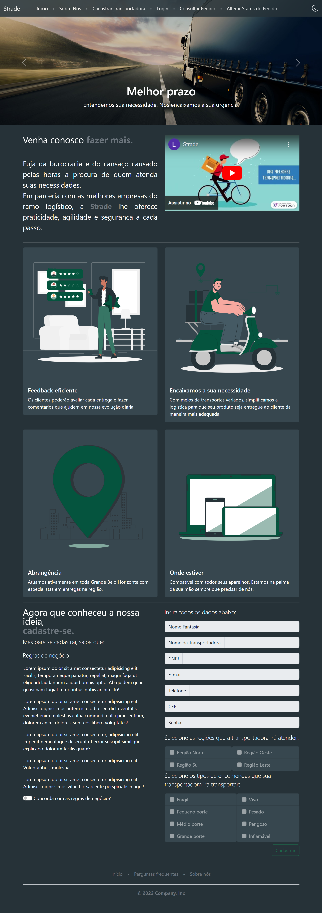

# Registro de Testes de Software

Pré-requisitos: <a href="3-Projeto de Interface.md"> Projeto de Interface</a>, <a href="8-Plano de Testes de Software.md"> Plano de Testes de Software</a>

Para cada caso de teste definido no Plano de Testes de Software, realize o registro das evidências dos testes feitos na aplicação pela equipe, que comprovem que o critério de êxito foi alcançado (ou não!!!). Para isso, utilize uma ferramenta de captura de tela que mostre cada um dos casos de teste definidos (obs.: cada caso de teste deverá possuir um vídeo do tipo _screencast_ para caracterizar uma evidência do referido caso).

## CT-06 - Verificar a função de Hipersensibilidade -Dark Mode 

>### Dark Mode Inativo:
>
>
>### Dark Mode ativo
>
>

## CT-02 – Cadastrar transportadora

### Cadastro Preenchido
>

### Aviso Cadastro Errado
Todos os campos de cadastro são validados e geram alerta de erro caso preenchido incorretamente.
>

### Aviso Cadastro Concluido

>

## CT-01 - Lista de Trasportadoras - Site Loja

### Preenchimento do CEP - Site Loja

>

### Listagem Trasnportadoras

>

## Avaliação

### CT-06 Verificar a função de Hipersensibilidade -Dark Mode
 
 O site Strade possui o recurso de Dark Mode e de acordo com os testes executados o site atualizou corretamente com as cores alteradas.

 ### CT-01 Verificar listagem das trasportadoras

 O sistema lista as transportadoras disponíveis para entrega no endereço indicado. Porém ainda não conseguimos listar mais que uma trasportadora e ao cadastrar nova, só aparece a primeira cadastrada.
 #### Plano de correção 
Atualização no Front-end para processamento de um Array de tamanho *n*.
 ### CT-2 Cadastrar Trasportadora

 O site cadastra a trasportadora, mas nem todos os dados (Nome fantasia e tipos de encomenda) estão sendo anexados ao banco de dados.
#### Plano de correção 
 Serão feitas atualizações no Back-end para o processamento e devido armazenamento desses Dados. 
